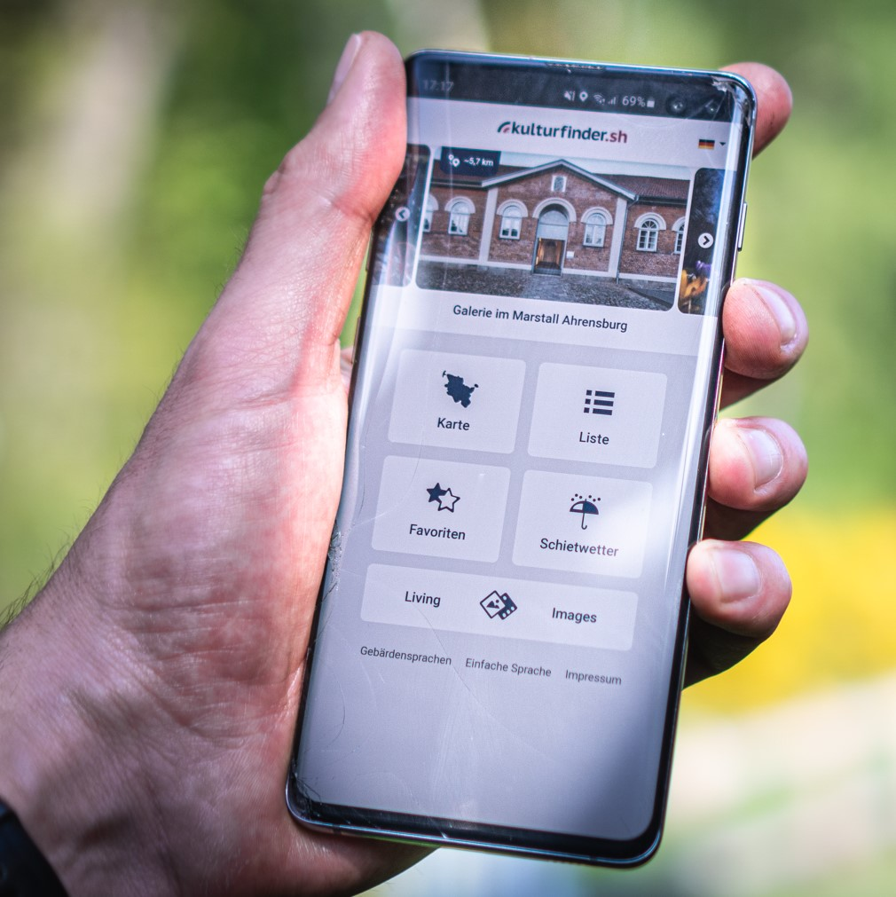

# Kulturfinder - Frontend

<a href="https://kulturfinder.sh" target="_blank">
    
</a>

<a href="https://kulturfinder.bremen.de" target="_blank">
    
</a>

Made by [Dataport](https://dataport.de) and [kultursphäre.sh](https://www.kultursphaere.sh/)

Productions:
- [kulturfinder.sh](https://kulturfinder.sh)
- [kulturfinder.bremen.de](https://kulturfinder.bremen.de)

## Beschreibung - description

Der Kulturfinder ist eine Web-App, die es den Nutzer:innen ermöglicht, mobil auf ihrem Smartphone
Kulturinstitutionen in ganz Schleswig-Holstein, Bremen und Bremerhaven zu finden. Geobasiert werden 
Kultureinrichtungen im Umkreis des Standortes des Nutzers auf einer Landkarte angezeigt. Zu jeder Institution gibt 
es zudem ein Foto sowie eine Beschreibung, die Adresse und weitere Angebote.

The Kulturfinder is a web-app that enables users to find cultural institutions throughout Schleswig-Holstein, Bremen
and Bremerhaven. Geobased cultural institutions in the vicinity of the user's location are displayed on a map. For 
each institution there is a photo, description, address and other offers for each institution.



[📺 Image Video 📺](https://vimeo.com/274652974)

### [kultursphäre.sh](https://www.kultursphaere.sh/)

Die kultursphäre.sh ist ein Projekt des Fachbereiches Medien der Fachhochschule Kiel. Das Projekt wird gefördert vom
Ministerium für Bildung, Wissenschaft und Kultur des Landes Schleswig-Holstein.

kultursphäre.sh is a project by the media department of Kiel University of Applied Sciences. The project is funded by
the Ministry of Education, Science, and Culture of the state of Schleswig-Holstein.

## Contributing

[Contributor License Agreement](./docs/CONTRIBUTOR-AGREEMENT.md)

[How to contribute](./docs/CONTRIBUTING.md)

### Environment-Variables

You can change some behavior via environment variables. Replace the values inside `.env` or create a file `.env.local`
(will not be checked in). Full docs for each variable are inside the `.env` file.

### Project setup

```
npm install
```

### Compiles and hot-reloads for development

```
npm run serve
```

### Compiles and minifies for production

```
npm run build
```

### Run your tests

```
npm run test
```

### Lints and fixes files

```
npm run lint
```

### Test service worker with local http-server

```
npm install http-server -g
npm run build
http-server dist
```

To test changes, rebuild with npm. The http-server does not have to be restarted for this.
